# TABLE OF CONTENTS

* [Web Application Development ](#web-application-development)

  * Languages: HTML, CSS, JS, PHP, MySQL
  
  * [Project Description](#project-description)

  * [Screenshots](#screenshots)

  * [Authors](#authors)

    

  ---
  
  ## Web Application Development

  This is a group assignments that aims to learn, understand and apply:

  * HTML, CSS, JS, PHP, MySQL
  
* Web server setup
  * Full stack development

  ### Project Description
  
  Online website selling new brands shoes for adults, kids, men and women.
  
  This development must include:
  
* development of dynamic webpages using event driven clients-sides scripts (HTML, CSS, and JavaScript)
  
  * Types of users: Admin, Member, and Guest
  
* Member: view, buy and discounts
  
  * Admin: add, delete, and edit data
  
* Guest: can only view website data
  * Manish and Womanish Design
  
  ### Screenshots
  
  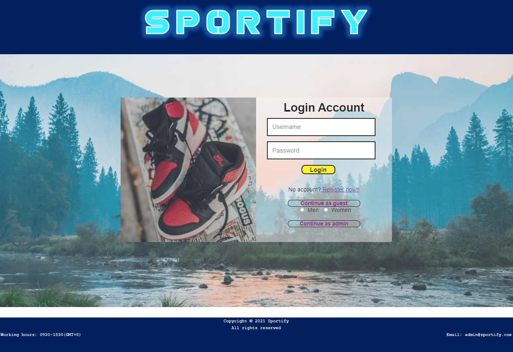
  
    
  
  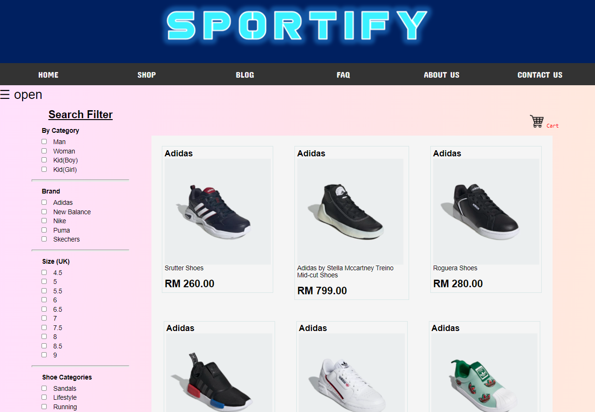

  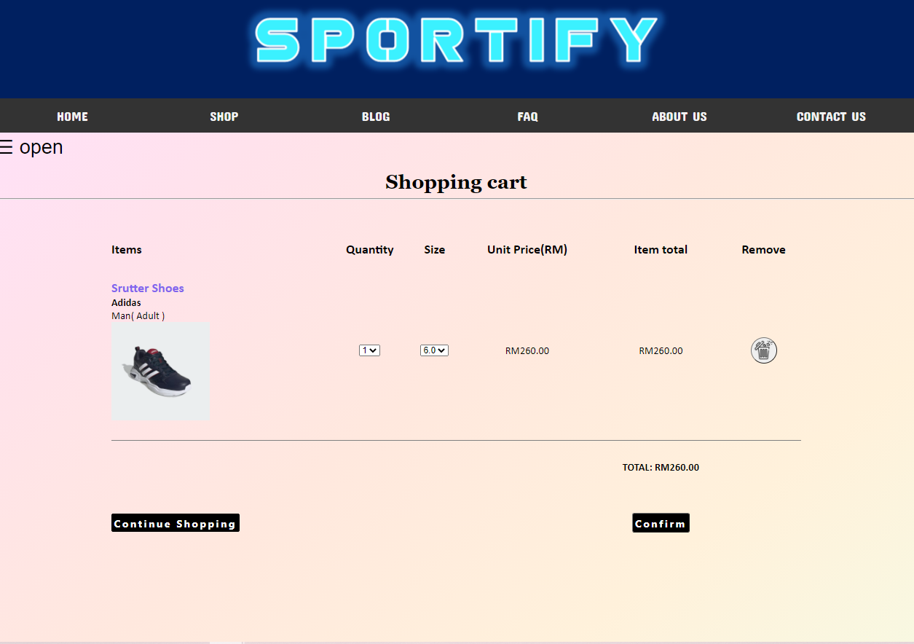

  

  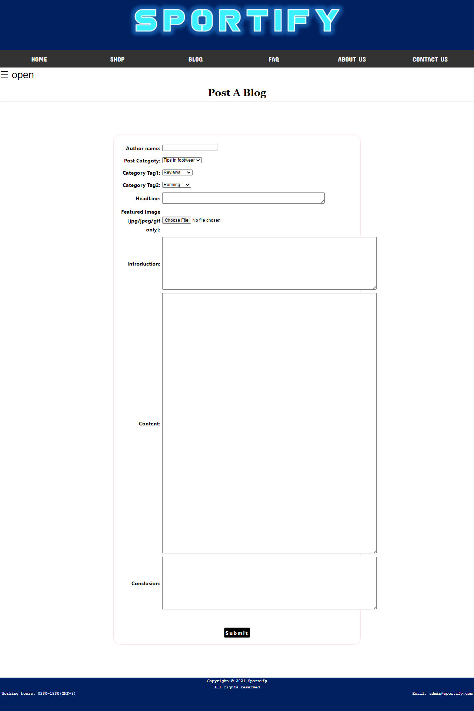

  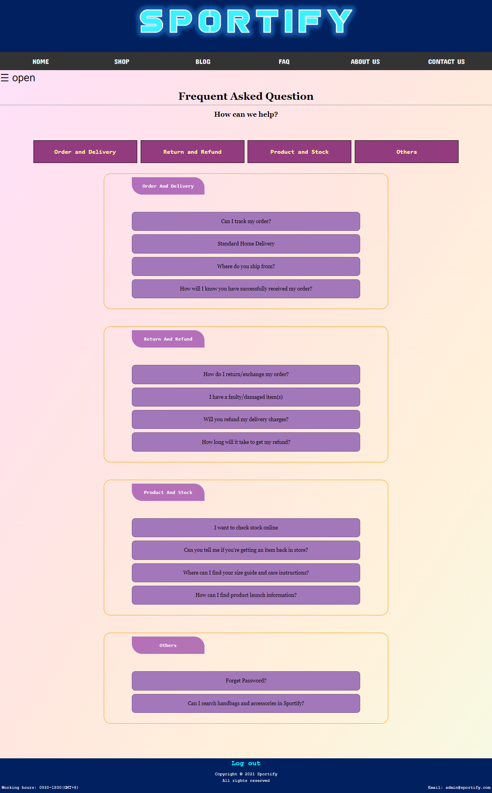

  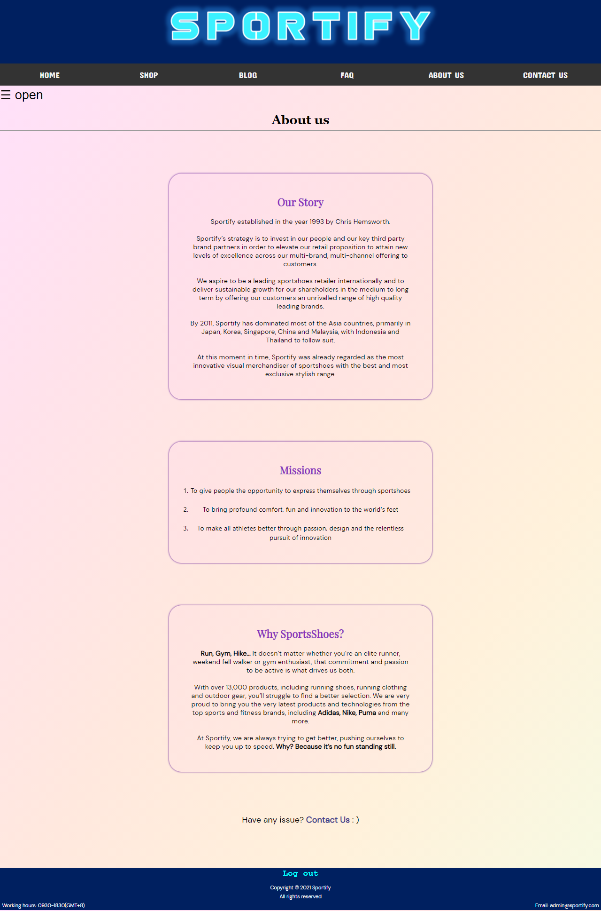

  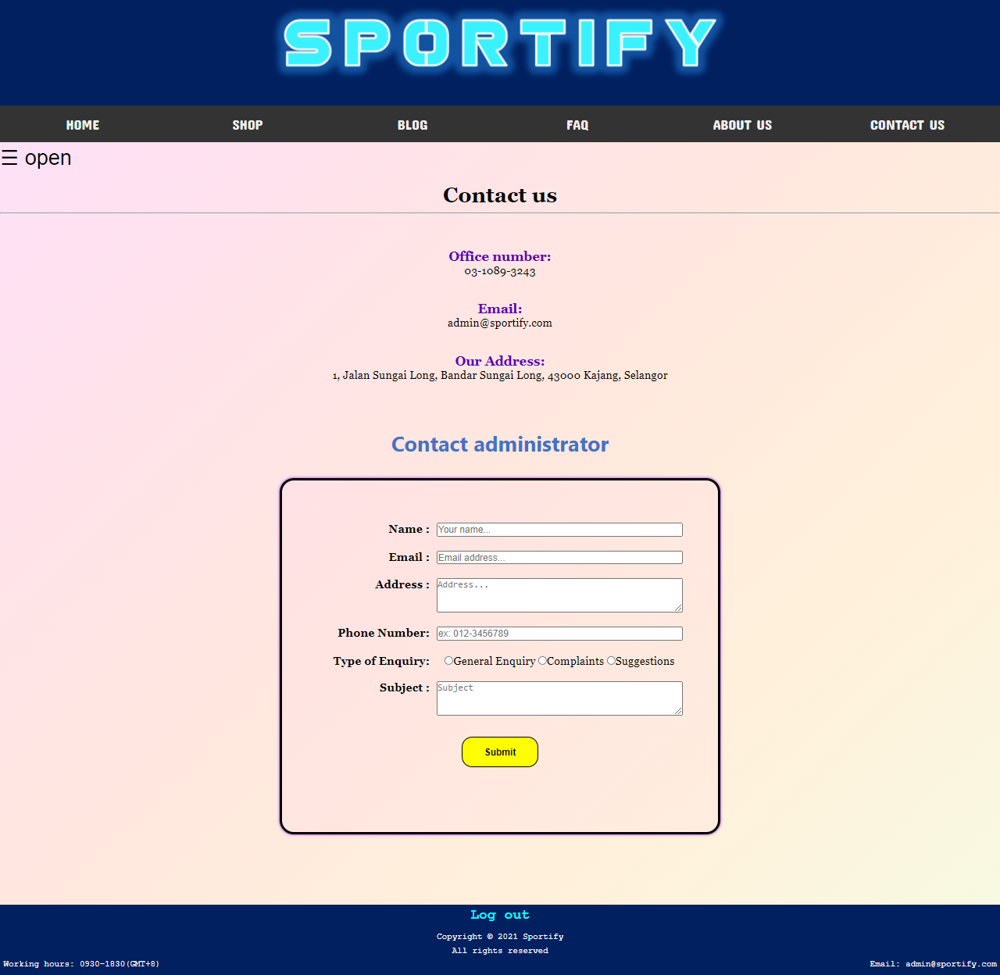

  

  #### Admin View

  

  

  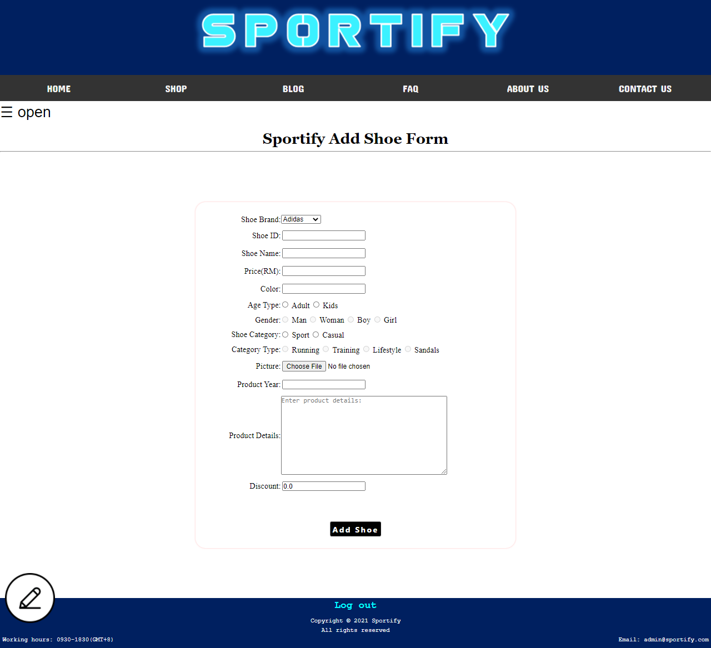

  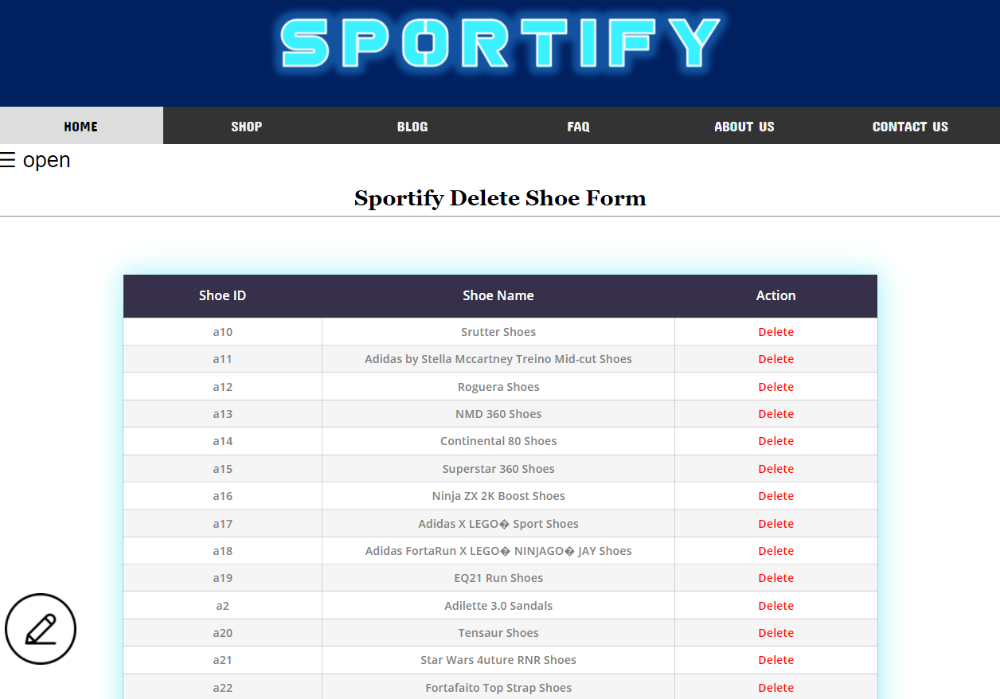

  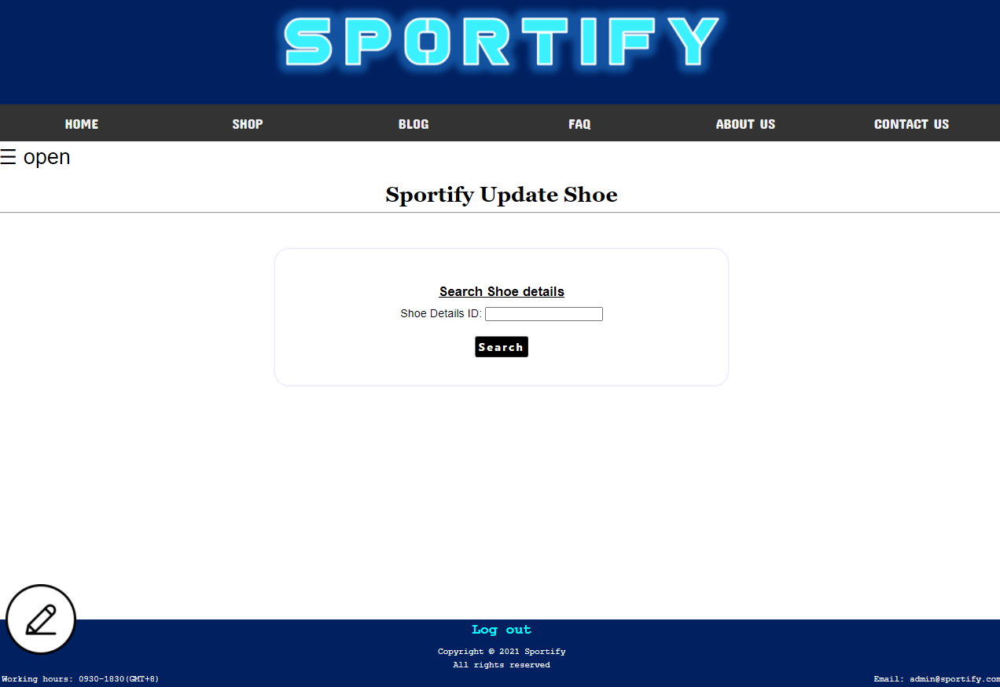

  

  

  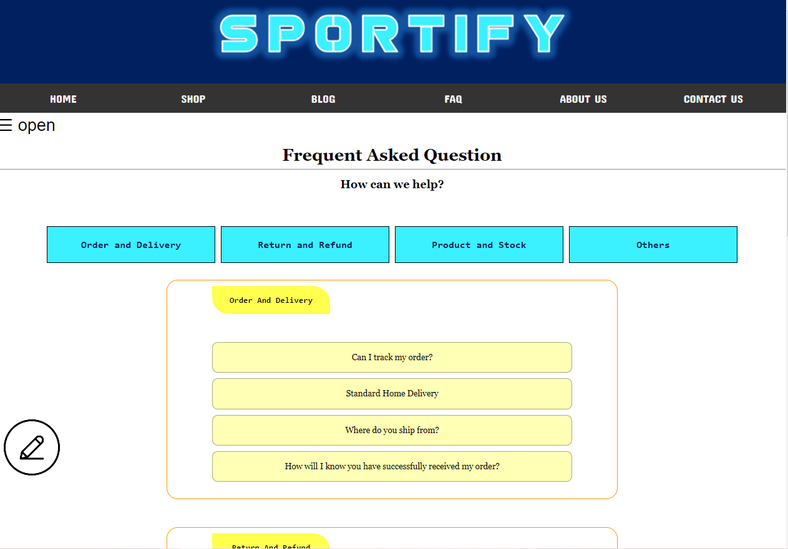

  

  

  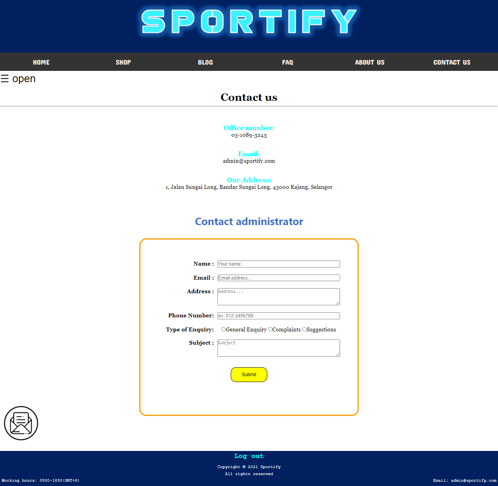

  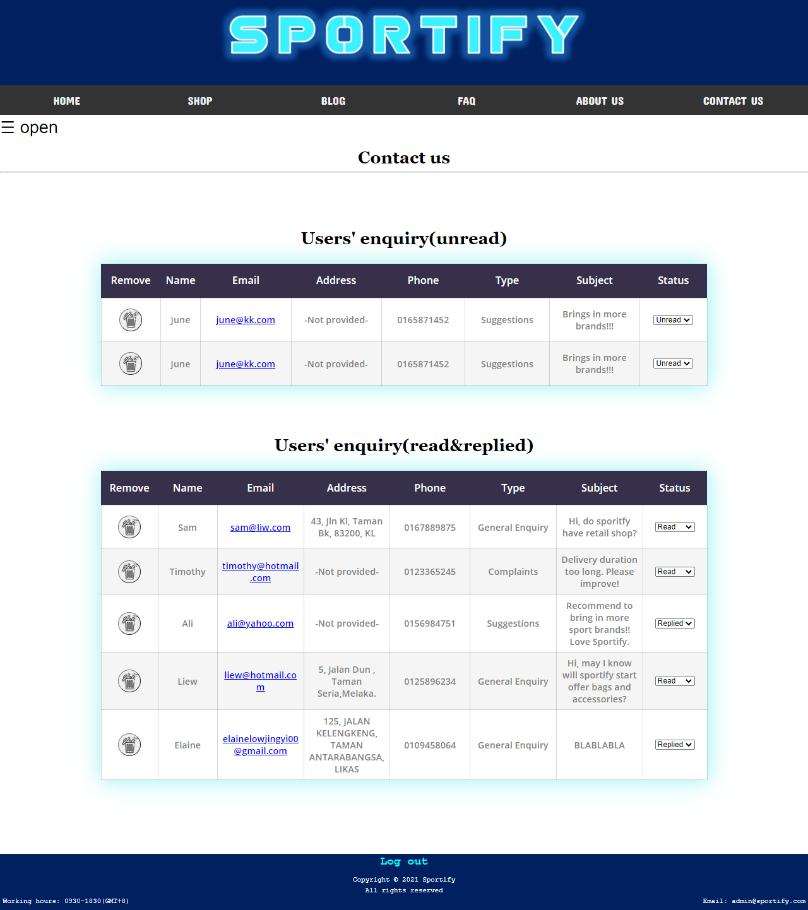

  #### Manish Design

  

### Authors 

* Elaine Low Jing Yi
* Low Ee Lyne
* Low Jia Wei
* Wong Yuk Han
* Teh Liang Sean

  

  

  

  

  

  

  

  

  

  

  

  

  

  

  

  

